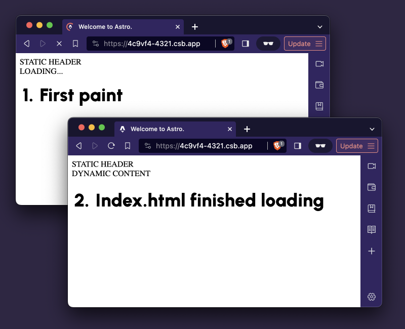

## HTML streaming and react server components
Streaming HTML allowed us to do some cool things for a while now. When a user requests a page on the website, we could send a static part like a header instantly and then stream the rest when we’re ready.

Recently I saw a demo with Next.js and react Suspense. It was the same HTML streaming, but with loading state! So instead of awkwardly showing to the user a header and an empty page we could now show a spinner or a full on skeleton UI. Neat!

It looks kinda like that:



So, I've decided to try to implement something similar in Astro framework as it supports SSR with streaming. 

## React server components with Next.js

First, let's take a look at how Next.js with suspense works.

[Check it out on CodeSandbox](https://codesandbox.io/p/sandbox/article-demo-next-js-with-suspense-l6v2js).

We define a react server component that does async work before render:

```javascript
// DynamicContent.tsx

export async function sleep(ms: number) {
  return new Promise((resolve) => setTimeout(resolve, ms));
}

export default async function DynamicContent() {
  // fake fetching of some data
  await sleep(2000);

  return <div>DYNAMIC CONTENT</div>;
}
```

And then we just wrap the async component with `<Suspense />` with a fallback property.

```javascript
// page.tsx
import DynamicContent from "./DynamicContent";
import { Suspense } from "react";

export default function Home() {
  return (
    <main>
      <header>STATIC HEADER</header>
      <Suspense fallback={<div>LOADING...</div>}>
        <DynamicContent />
      </Suspense>
    </main>
  );
}
```

Cool! Now when HTML for our page will be streamed we'll see a "LOADING" fallback first and then it will update to "DYNAMIC CONTENT".

To achieve this nice effect, Next.js does some js magic behind the scenes to append our freshly arrived content and remove the loading placeholder.

_But who wants that nasty JavaScript on our otherwise perfect static websites, right?_

## Progressive loading with Astro streaming

So here is a zero javascript solution I came up with when trying to achieve the same effect in my Astro project. _But the same approach can be used for any other framework that supports SSR with streaming_.

[Check it out on CodeSandbox](https://codesandbox.io/p/sandbox/article-demo-astro-progressive-loading-4c9vf4).

_If you are not familiar with Astro, don't be affraid it's really straightforward!_

First, let's define the magical component that allows us to show placeholder that gets replaced by dynamic content.

>`.fallback:has(+ *)` is a selector that will select `.fallback` if any element exists after `.fallback`. Once any new HTML element was streamed after the `.fallback`, we'll just hide the fallback. 

>`slot` is a special element that allows us to insert markup into the component in a specific place. In React it would've been done via separate props that accept react components.

```html
<!-- LoadingFallback.astro -->

<div class="contents fallback">
    <slot name="fallback" />
</div>
<slot name="content" />

<style>
    .fallback:has(+ *) {
        display: none;
    }
</style>
```

Then in a similar fashion as we did with react server components let's define the page and the `<DynamicContent />` component.

>In Astro all JS code between `---` is executed on the server and is never shipped to the browser, really similar to how react server components work.

```javascript
---
// DynamicContent.astro

export async function sleep(ms: number) {
    return new Promise((resolve) => setTimeout(resolve, ms));
}

// fake fetching of some data
await sleep(2000);
---

<div>DYNAMIC CONTENT</div>
```

On our index page we just use the components we've just defined.

> `slot` prop allows us to specify in which slot of `<LoadingFallback />` should content be inserted.

```javascript
---
// index.astro

import Layout from "../layouts/Layout.astro";
import LoadingFallback from "../components/LoadingFallback.astro";
import DynamicContent from "../components/DynamicContent.astro";
---

<Layout title="Welcome to Astro.">
  <main>
    <header>STATIC HEADER</header>
    <LoadingFallback>
      <div slot="fallback">LOADING...</div>
      <DynamicContent slot="content" />
    </LoadingFallback>
  </main>
</Layout>

```

And boom! We've achieved the same effect as in the 1st demo. Maybe even better as we don't need any client side JS for that 😉.

The only downside I’m seeing so far is that the loading placeholder stays in the HTML markup. This could be a potential problem for SEO if crawler thinks we’re trying to scam it by showing different content to the bot and website visitors. _However, I don’t think it’s a real concern, as hiding elements with CSS is not that uncommon in web dev._

